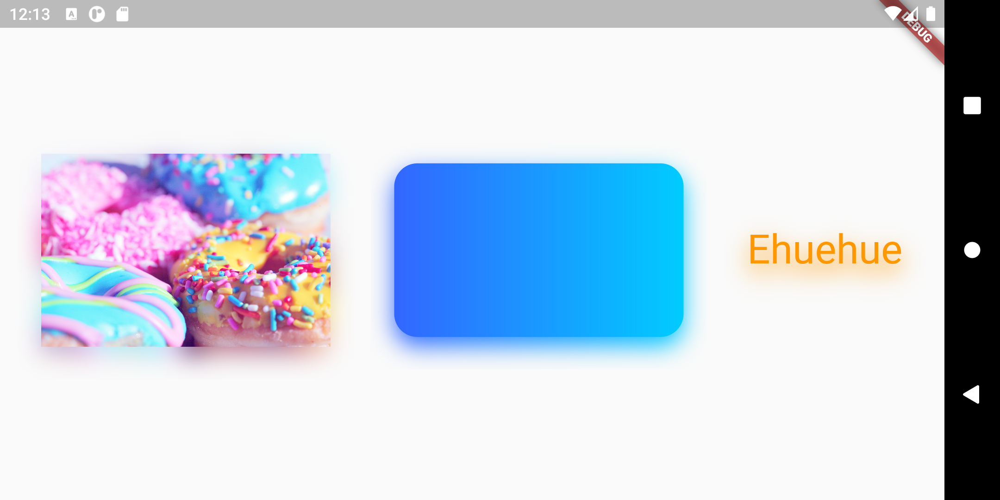

# DropShadow

Drop shadow effect for any widget in flutter




## <b>Parameters</b>
   ```dart
   Widget child; // required
   double blurRadius; // default: 10.0
   double borderRadius; // default: 0.0
   Offset offset; // default: Offset(0.0, 8.0)
   double opacity; // default: 1.0
   double spread; // default: 1.0
   ```
## <b>Example Usage</b>
```dart

DropShadow(
  child: Image.network(
    'https://images.pexels.com/photos/1191639/pexels-photo-1191639.jpeg',
    width: 250,
  ),
);

```